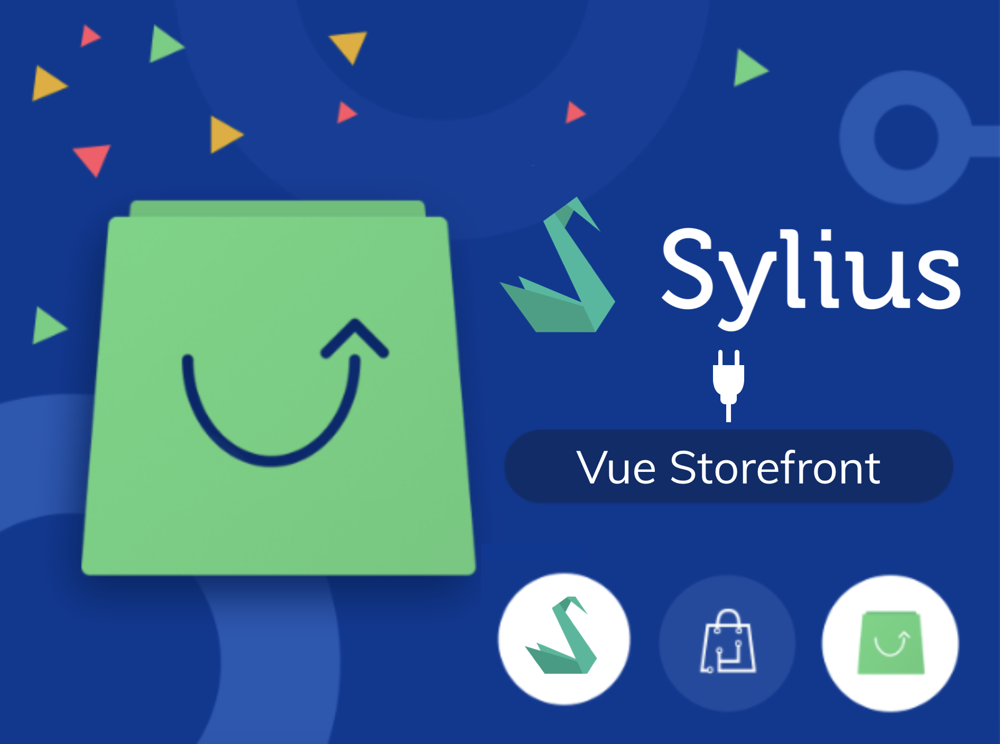

<h1 align="center">
    <a href="http://bitbag.io" target="_blank">
        
    </a>
    <br />
    <a href="https://packagist.org/packages/bitbag/vuestorefront-plugin" title="License" target="_blank">
        
    </a>
    <a href="https://packagist.org/packages/bitbag/vuestorefront-plugin" title="Version" target="_blank">
        
    </a>
    <a href="http://travis-ci.org/BitBagCommerce/SyliusVueStorefrontPlugin" title="Build status" target="_blank">
            
        </a>
    <a href="https://scrutinizer-ci.com/g/BitBagCommerce/SyliusVueStorefrontPlugin/" title="Scrutinizer" target="_blank">
        
    </a>
    <a href="https://packagist.org/packages/bitbag/vuestorefront-plugin" title="Total Downloads" target="_blank">
        
    </a>
    <p>
        
    </p>
</h1>

## BitBag SyliusVueStorefrontPlugin

A bridge between [Sylius](https://sylius.com) and [Vue Storefront](https://vuestorefront.io).

## About us

At BitBag we do believe in open source. However, we are able to do it just beacuse of our awesome clients, who are kind enough to share some parts of our work with the community. Therefore, if you feel like there is a possibility for us working together, feel free to reach us out. You will find out more about our professional services, technologies and contact details at https://bitbag.io/.

## Overall info

This document assumes that you are already familiar with Vue Storefront and its technology stack.  
If that's not the case please check [VSF Documentation](https://docs.vuestorefront.io/guide/) and [GitHub repository](https://github.com/DivanteLtd/vue-storefront).

Please also check [Sylius Documentation](https://docs.sylius.com/en/latest/) and [Sylius-Standard](https://github.com/Sylius/Sylius-Standard) if you are new to Sylius.

Depending on your preferences, the plugin can also fully replace [VSF API](https://github.com/DivanteLtd/vue-storefront-api/) - you will only need VSF front app if you choose so.  
Sylius ShopBundle is also no longer needed as Vue Storefront will be your new ... Storefront. :)

## Vue Storefront + Sylius Demo

We've created a demo app that showcases usage of this plugin. Visit [vsf.bitbag.shop](https://vsf.bitbag.shop) to check it out!  
The Sylius admin panel is accessible at [syliusvsf.bitbag.shop/admin](https://syliusvsf.bitbag.shop/admin). Admin credentials: `sylius : sylius`.


## Installation

### Requirements

We work on stable, supported and up-to-date versions of packages. We recommend you to do the same.  
Please also check [Vue Storefront requirements](https://docs.vuestorefront.io/guide/installation/linux-mac.html#requirements).

| Package       | Version        |
|:-------------:|:--------------:|
| PHP           |  7.3 (>= 7.2)  |
| MySQL         |  8.0.x (>= 5.7)|
| Elasticsearch |  6.8.x         |
| Vue Storefront|  1.11          |

**Important note**  
Please inspect files stored in `tests/Application` directory (especially `config` subdirectory)   
to make sure that you fully understand installation steps written below.

We recommend you to disable Sylius ShopBundle as you will no longer need it.   
Please refer to [Sylius Documentation - How to disable Sylius shop?](https://docs.sylius.com/en/1.6/cookbook/configuration/disabling-shop-admin-api.html#how-to-disable-sylius-shop) for details.

---

First, add this plugin as dependency to your Sylius project. 
 
 ```
 $ composer require bitbag/vue-storefront-plugin
 ```

Add plugin to `config/bundles.php`:

```
return [
    ...
    FOS\ElasticaBundle\FOSElasticaBundle::class => ['all' => true],
    BitBag\SyliusVueStorefrontPlugin\SyliusVueStorefrontPlugin::class => ['all' => true],
    Lexik\Bundle\JWTAuthenticationBundle\LexikJWTAuthenticationBundle::class => ['all' => true],
    Gesdinet\JWTRefreshTokenBundle\GesdinetJWTRefreshTokenBundle::class => ['all' => true],

    // Optional, for handling CORS (Cross-Origin Resource Sharing) requests 
    Nelmio\CorsBundle\NelmioCorsBundle::class => ['all' => true],
];
```

---

Add few variables to your .env file:

```text
APP_CHANNEL_CODE="<code of Sylius channel you want to use>"

JWT_SECRET_KEY=%kernel.project_dir%/config/jwt/private.pem 
JWT_PUBLIC_KEY=%kernel.project_dir%/config/jwt/public.pem
JWT_PASSPHRASE=bitbag

ELASTICSEARCH_HOST=localhost
ELASTICSEARCH_PORT=9200
ELASTICSEARCH_INDEX=vue_storefront_catalog

// Optionally, when using Nelmio CORS Bundle
CORS_ALLOW_ORIGIN=^https?://(localhost|127\.0\.0\.1)(:[0-9]+)?$
```

To generate JWT public and secret keys please run commands below in Sylius' project directory:

```
$ mkdir -p config/jwt
$ openssl genpkey -out config/jwt/private.pem -aes256 -algorithm rsa -pkeyopt rsa_keygen_bits:4096
$ openssl pkey -in config/jwt/private.pem -out config/jwt/public.pem -pubout
```

Then set value of `JWT_PASSPHRASE` environment variable with passphrase that you've entered during running commands above.

---

Now it is time to edit `config/packages/security.yaml` file.

Add line below to `parameters` at the top of the file:  
`bitbag.vue_storefront.security.regex: "^/vsbridge"`

Add code below to `security -> firewall` part:

```
        vs_bridge_user_login:
            pattern: "%bitbag.vue_storefront.security.regex%/user/login"
            stateless: true
            anonymous: true
            provider: sylius_shop_user_provider
            json_login:
                provider: sylius_shop_user_provider
                check_path: /vsbridge/user/login
                password_path: password
                success_handler: bitbag_sylius_vue_storefront_plugin.lexik_jwt_authentication.handler.authentication_success
                failure_handler: bitbag_sylius_vue_storefront_plugin.lexik_jwt_authentication.handler.authentication_failure
                require_previous_session: false

        vs_bridge:
            pattern: "%bitbag.vue_storefront.security.regex%"
            stateless: true
            anonymous: true
            provider: sylius_shop_user_provider
            guard:
                provider: sylius_shop_user_provider
                authenticators:
                    - lexik_jwt_authentication.jwt_token_authenticator
```

Add line below to `security -> access_control` part:  
`- { path: "%bitbag.vue_storefront.security.regex%/user/login", role: IS_AUTHENTICATED_ANONYMOUSLY }`

---

Now go to `config/routes.yaml` file in your Sylius app and paste there:

```
sylius_vue_storefront_plugin:
    resource: "@SyliusVueStorefrontPlugin/Resources/config/routing.yaml"
```

---

Create new file `gesdinet_jwt_refresh_token.yaml` (or name it however you like) inside `config/packages` directory and paste inside it:

```
gesdinet_jwt_refresh_token:
    firewall: vs_bridge
    token_parameter_name: refreshToken
    user_provider: sylius_shop_user_provider
```
---

Paste lines below inside `config/packages/lexik_jwt_authentication.yaml`:

```
lexik_jwt_authentication:
    secret_key: '%env(resolve:JWT_SECRET_KEY)%'
    public_key: '%env(resolve:JWT_PUBLIC_KEY)%'
    pass_phrase: '%env(JWT_PASSPHRASE)%'

    token_extractors:
        query_parameter:
            enabled: true
            name: token
```

---

Copy `etc/vsf-config/local.json` file from this repository to `config/local.json` of Vue Storefront project directory.  
In that file you only need to replace every occurence of `<insert-your-hostname>` with URL of your store.  
You don't have to change anything else as sensible defaults are provided by us, that are proven to work in Vue Storefront v1.11.   
If your configuration settings differ from defaults provided with the plugin and you run into problems don't hesitate to create issue on GitHub or contact us directly at hello@bitbag.io.

## Architecture

VueStorefront fetches data in two ways - **statically** and **dynamically**.  
Less frequently updated data is stored in **Elasticsearch**: 
1. Products
2. Categories (Sylius taxons)
3. Attributes (Sylius product options)  
 
Everything else is fetched dynamically using provided API, including: 
* customers' accounts (Sylius Customer, ShopUser)
* carts, orders (Sylius Order)
* shipping methods
* payment methods
* and more ...

### Elasticsearch

Everything related to Elasticsearch is contained within `Elastisearch` 
with the exception of FOS Elastica Bundle configuration which can be found in `src/Resources/config/indexes` directory.  
To have the data from Sylius mapped in ES, we have created `Transformer`s providing object translations to ES indexes.  
Schema of indexes is described in files stored in `Document` directory. 

It's important to note once again that **only Elasticsearch 6 is fully supported currently**.  
Support for ES 7 is on the way - once [ruflin/elastica](https://github.com/ruflin/Elastica) and [FOSElasticaBundle](https://github.com/FriendsOfSymfony/FOSElasticaBundle) start supporting it, we will as well.

## Using the plugin within Sylius Standard app, with VSF

It is no surprise that you must have products, taxons etc. within your Sylius instance to benefit from VSF.  
Therefore we assume that you have a shop already running.  
If it's not the case you might want to run commands below on freshly cloned [Sylius Standard](https://github.com/Sylius/Sylius-Standard) repository:

```
$ composer install 
$ yarn install
$ yarn build
$ php bin/console doctrine:database:create
$ php bin/console doctrine:schema:update --force
$ php bin/console sylius:fixtures:load
```

.. to add all needed entities from fixtures to database.

Only then you can run

```text
$ php bin/console fos:elastica:populate
```

to populate Elasticsearch indexes and let refresher contained within the plugin to automatically update the data in ES in real time.

## Extending the plugin

### Extending requests, commands/queries

The easiest way to extend the existing request classes and add new properties is to inherit from them.  
Because of the way we denormalize incoming requests, you don't need constructor in that class.
You must only:
 * add public properties to the class
 * override `getCommand()` or `getQuery()` method
 
Optionally you may want to add constraint to your properties that would validate incoming data.  
We use separate .xml files for that as you can see in `src/Resources/config/validation` directory.
 
For example let's add locale to the coupon:

```
use BitBag\SyliusVueStorefrontPlugin\Request\Cart\ApplyCouponRequest;

final class ApplyLocalizedCouponRequest extends ApplyCouponRequest
{
    /** @var string */
    pubic $locale;

    public function getCommand(): CommandInterface
    {
        return new ApplyCoupon($this->token, $this->cartId, $this->coupon, $this->locale);
    }
}
```

In the same manner the command would need to be created extending the ApplyCoupon class.  
Then you only need to change one parameter in the configuration file:

```
bitbag_sylius_vue_storefront_plugin:
    request_classes:
        apply_coupon: \AddLocalizedCouponRequest
```

### Extending handlers

The main way to extend a handler is to decorate it. This makes adding functionality before and after the handler easy.  
Please check example of extending view below and/or follow [Symfony Documentation - How to Decorate Services](https://symfony.com/doc/4.4/service_container/service_decoration.html) guide.

However, if you want to change the logic in the handler, you need to overwrite it.    
This can be done by registering the new handler with the same service id.  
Do not just add it with a new service id otherwise, it will execute both handlers.

### Extending views

When extending the views, two places need to be modified - view class and view factory.

ViewFactories should be decorated just like Handlers mentioned above. You can also completely override them if you prefer to do so.

```
use BitBag\SyliusVueStorefrontPlugin\Factory\Cart\Totals\TotalsViewFactoryInterface;

class NiceTotalViewFactory implements TotalViewFactoryInterface
{
    private $innerTotalViewFactory;

    public function __construct(TotalsViewFactoryInterface $innerTotalViewFactory)
    {
        $this->innerTotalViewFactory = $innerTotalViewFactory;
    }

    public function create(OrderInterface $order): NiceTotalView
    {
        /** @var NiceTotalView $totalView */
        $totalView = $this->innerTotalViewFactory->createNew();

        $totalView->nicePersonDiscount = $orderInterface->getNiceDiscount();

        return $totalView;
    }
}
```

You need to define this service in xml (or yaml) file:

```
<service class="NiceTotalView" id="app.factory.nice_total_view_factory"
         decorates="bitbag_sylius_vue_storefront_plugin.factory.cart.totals.totals_view_factory">
       <argument type="service" id="app.factory.nice_total_view_factory.inner" />
</service>
```

and change the view class in configuration file:

```
bitbag_sylius_vue_storefront_plugin:
    view_classes:
        totals: \NiceTotalView
```

### Additional reading resources for developers

To be able to contribute to the plugin make sure that you familiarize yourself with:

* [Vue Storefront Integration SDK](https://github.com/DivanteLtd/vue-storefront-integration-sdk/)
* [Vue Storefront](Shttps://github.com/DivanteLtd/vue-storefront)
* [Vue Storefront API](Shttps://github.com/DivanteLtd/vue-storefront-api)
* [Sylius Shop API Plugin](https://github.com/Sylius/ShopApiPlugin/)
* [Sylius Contribution Guide](https://docs.sylius.com/en/latest/contributing/)

Additionally you might want to get to know VSF better:
* [Vue Storefront Documentation](https://docs.vuestorefront.io/guide/) - to learn how to customize VSF frontend part
* [Vue Storefront Journal](https://medium.com/the-vue-storefront-journal) - blog where new ideas are shared and what lies ahead is announced
